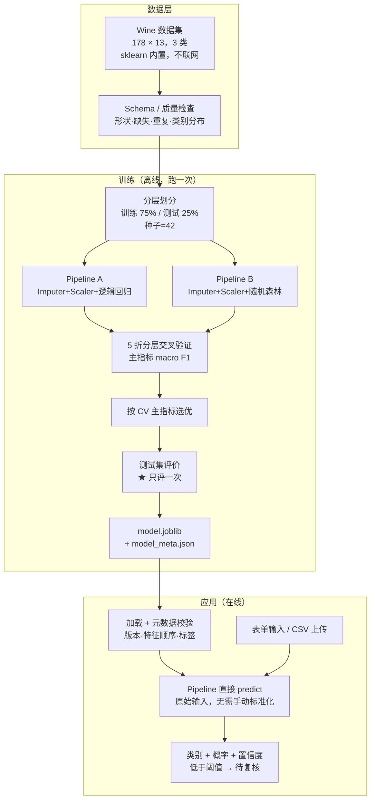

# wine-classifier-app —— 机器学习智能分类系统

《开源软件与新技术》实验04 成品。以 **scikit-learn 1.x** 为基线，
用 **Pipeline + ColumnTransformer** 把预处理和模型绑在一起，
比较**逻辑回归**与**随机森林**两种算法，锁定最佳完整 Pipeline，
再由 **Streamlit** 界面加载并对用户输入实时预测。

在实验要求的基础上做了两项自主功能：**置信度阈值 + 人工复核转交**、**批量 CSV 预测**。

- 作者：王锐兵（软件2304，学号 23110506126）
- 界面：`streamlit run app.py` → <http://localhost:8502>
- 上游：scikit-learn（BSD-3-Clause）、Streamlit（Apache-2.0）

> 本仓库是二次开发成品，**不是** scikit-learn / Streamlit 的再分发。
> 数据集 Wine 的许可证（CC BY 4.0）与代码许可证是两回事，见 [NOTICE.md](NOTICE.md)。

---

## 一、目标用户与问题场景

**目标用户**：想用机器学习解决一个分类问题、但卡在"Notebook 里跑通了，
却没法给别人用"这一步的人。

**问题场景**：很多课程作业都停在 Notebook 里——模型能出一个分数，
但普通用户调不到、也说不清"输入字段、预处理、模型版本"是不是一致。
更常见的坑是：训练时做了标准化，推理时忘了做，**不报错但结果全错**。

本项目的做法：把预处理和模型封进**同一个 Pipeline** 一起保存，
应用只加载这个 Pipeline，从结构上消灭"训练/推理不一致"。

**功能清单**：

| 功能 | 说明 |
| --- | --- |
| 训练与比较 | 5 折分层交叉验证比较逻辑回归 / 随机森林，按 macro F1 选优 |
| 完整评价 | Accuracy、Precision、Recall、F1（macro + weighted）、混淆矩阵、每类明细 |
| 模型保存 | 完整 Pipeline + `model_meta.json`（版本、特征顺序、标签映射、指标、SHA256） |
| 实时预测 | Streamlit 表单输入 13 个特征，返回类别与各类概率 |
| **置信度阈值** | 低于阈值不自动给结论，标成"待复核"（自主功能①） |
| **批量预测** | 上传 CSV 逐行预测，坏行单独报错（自主功能②） |
| 阈值分析 | 量化展示"阈值 ↑ → 覆盖率 ↓、自动准确率 ↑"的取舍 |
| 模型信息页 | 在界面上直接看交叉验证对比表、混淆矩阵、完整元数据 |

---

## 二、技术栈与系统架构

| 层 | 用了什么 | 版本 |
| --- | --- | --- |
| 训练与评价 | scikit-learn | 见 `requirements.txt`（按实际安装写入） |
| 数据处理 | pandas / NumPy | 同上 |
| 模型持久化 | joblib | 同上 |
| 交互界面 | Streamlit | 同上 |
| 测试 | pytest | 同上 |

### 架构



### 关键设计决策

**决策一：预处理必须进 Pipeline，不能单独保存。**

这是本实验最核心的一条。`StandardScaler` 一旦被拆出来单独 fit，
`cross_validate` 就会在**全量数据**上拟合它，然后每一折都用这个"见过测试数据"的
scaler 去变换——这就是标准的**数据泄漏**。

放进 Pipeline 后，每个折内部只在该折的训练部分拟合，泄漏被结构性地杜绝了。
代价是保存的模型文件大一点（要把 scaler 的均值和方差一起存），完全值得。

**决策二：用分层划分，不用普通随机划分。**

wine 三类是 59 / 71 / 48，不算极端但不均匀。不分层的话，
小类别可能在测试集里只剩一两个，指标抖动会大到没有参考价值。

**决策三：模型选择用交叉验证，测试集只评一次。**

代码结构上做了约束：`zui_zhong_pingjia()` 只在 `shiji_xunlian()` 末尾调用一次。
一旦有人想"用测试集挑个更好的模型"，就得改训练脚本的流程，改不动就说明设计生效了。

**决策四：主指标选 macro F1 而不是 accuracy。**

accuracy 会被大类带偏。macro F1 对三个类同样看重，
更符合"三个类别都别判错"这个实际诉求。

**决策五：保存完整 Pipeline + 元数据，加载时校验。**

`model_meta.json` 里存了 scikit-learn 版本、特征名与顺序、标签映射、指标、
训练时间、Git Commit、数据 SHA256、模型 SHA256。
`jiazai_moxing()` 加载时会校验版本和特征顺序，
不一致直接抛错——**宁可报错，也不要静默给出错误预测**。

**决策六：置信度阈值（自主功能①）**

对每一类模型都会给一个概率，取最大值当置信度。
置信度低于阈值时，**不自动给结论**，标成"待复核"。

为什么要这么做：实际业务里判错的代价是不对称的。
把 A 类当 B 类处理，可能比"多找个人看一眼"严重得多。
界面上还有一个阈值分析页，量化展示"阈值提高 → 自动判定变少、但更准"这个取舍。

**决策七：批量预测逐行容错（自主功能②）**

实验明确要求"不因一行坏数据使整批无结果"。
所以 `yuce_piliang()` 对每一行单独 try/except，
坏行记录「第几行 + 具体原因」，好行照常出结果。

---

## 三、环境要求

| 软件 | 要求 | 本机实测 |
| --- | --- | --- |
| Windows / Linux / macOS | 64 位 | Windows |
| Python | 3.11 / 3.12 / 3.13 | 3.13.14 |
| 内存 | 2 GB 以上（纯 CPU） | — |
| GPU | **不需要** | — |
| 联网 | 训练和推理都不需要 | — |

```powershell
python --version
.\.venv\Scripts\python -c "import sklearn,streamlit;print(sklearn.__version__, streamlit.__version__)"
```

---

## 四、安装、训练、运行

```powershell
# ① 一键安装（建 venv + 装依赖 + 跑测试）
.\scripts\anzhuang.ps1

# 或者手动
python -m venv .venv
.\.venv\Scripts\python -m pip install -r requirements.txt

# ② 训练并比较两种算法
.\scripts\xunlian.ps1
#   等价于： .\.venv\Scripts\python src\xunlian.py

# ③ 启动界面
.\scripts\qidong.ps1
#   等价于： .\.venv\Scripts\python -m streamlit run app.py
```

停止：界面是前台进程，`Ctrl+C` 即可。

> 依赖装不上时可以先换镜像：
> `.\scripts\anzhuang.ps1 -Jingxiang https://pypi.tuna.tsinghua.edu.cn/simple/`

---

## 五、演示流程

| 步骤 | 操作 | 预期结果 |
| --- | --- | --- |
| 1 | `.\scripts\xunlian.ps1` | 打印两算法的 CV 对比表、选中算法、测试集四项指标和混淆矩阵 |
| 2 | 查看 `models\model_meta.json` | 有 SHA256、特征顺序、标签映射、指标 |
| 3 | `.\scripts\qidong.ps1` 打开界面 | 侧边栏显示算法名、训练时间、SHA256 前 16 位 |
| 4 | 「单条预测」保持默认值点预测 | 显示类别、置信度、各类概率条 |
| 5 | 把置信度阈值滑到 0.95 | 提示变成"低于阈值，建议人工复核"（**自主功能①**） |
| 6 | 「批量预测」→ 点"用示例数据试一下" | 8 行结果表，可下载 CSV（**自主功能②**） |
| 7 | 上传一个含坏行的 CSV | 坏行列在下方说明原因，其余行照常出结果 |
| 8 | 「阈值分析」 | 覆盖率 / 自动准确率随阈值变化的表格和折线图 |
| 9 | 「模型信息」 | 两算法对比表、混淆矩阵、每类明细、完整 JSON |
| 10 | 关掉界面重新启动 | 加载的是 `models/` 里的模型，不会重新训练 |

---

## 六、测试

```powershell
.\scripts\ceshi.ps1                        # 一键跑全部
.\.venv\Scripts\python -m pytest tests -q  # 只跑 pytest
```

| 测试类型 | 实验要求 | 本仓库 | 文件 |
| --- | --- | --- | --- |
| 数据/划分测试 | ≥5 | 13 条 | `tests/test_shuju.py` |
| 模型评价 | ≥2 | 含在 Pipeline 测试里（两算法各跑一遍 CV） | `tests/test_pipeline.py` |
| Pipeline 测试 | ≥6 | 11 条 | `tests/test_pipeline.py` |
| 应用测试 | ≥6 | 16 条 | `tests/test_yuce.py` |
| 自主功能测试 | ≥3 | 阈值分析 3 条 + 批量 5 条 | `tests/test_yuce.py` |

实测结果和失败用例见 [docs/ceshi-jilu.md](docs/ceshi-jilu.md)。

---

## 七、二次开发内容（与上游基线的差异）

scikit-learn 和 Streamlit 都是**库**，不是可以直接换名提交的完整应用。
本项目的界面、Schema、训练脚本、模型卡、测试和自主功能全部是本人实现的。

| 序号 | 我做了什么 | 上游有没有 |
| --- | --- | --- |
| 1 | 整个 Streamlit 应用与四个标签页 | 没有，Streamlit 只是库 |
| 2 | 训练脚本：CV 比较 + 选优 + 一次测试 + 元数据 | 没有 |
| 3 | `model_meta.json` 元数据设计与加载时校验 | 没有，joblib 只管存取 |
| 4 | 输入 Schema 校验（缺列、非数字、列顺序） | 没有 |
| 5 | **置信度阈值 + 人工复核转交**（自主功能①） | 没有 |
| 6 | **批量 CSV 预测 + 逐行容错 + 下载**（自主功能②） | 没有 |
| 7 | 阈值-覆盖率-准确率的量化分析页 | 没有 |
| 8 | 模型卡 `model_card.md` | 没有 |

### 自主功能的设计理由与证据

**① 置信度阈值 + 人工复核**
- 解决的用户决策问题：模型给出的判定能不能直接采信？
- 验证方法：「阈值分析」页用测试集算出 8 个阈值下的**覆盖率**和**自动判定准确率**。
- **实测结论（和预期不一样，如实记录）**：阈值从 0 提到 0.9，覆盖率从 100% 掉到 64.4%，
  但自动准确率**一直是 100%**。原因是随机森林在这 45 个测试样本上本来就全判对了，
  没有"判错但很自信"的样本可以被阈值过滤掉——**阈值只有成本、没有收益**。
  这说明阈值机制只对"高自信的错误"有用，不是万能的。
- 边界说明：这只是 45 个测试样本上的统计，样本太少数字会抖；
  真实系统里的阈值应该由误判代价决定，不能挑一个好看的数。

**② 批量 CSV 预测**
- 解决的用户决策问题：一条条填表单太慢。
- 验证方法：`test_piliang_huai_hang_bu_yingxiang_zhengpi` 故意弄坏第 3、5 行，
  断言另外 8 行照常出结果、坏行的行号被正确报出。
- 边界说明：编码只尝试 UTF-8 → GBK 两种；列名必须完全匹配训练 Schema。

---

## 八、安全注意事项

| 风险 | 处理方式 |
| --- | --- |
| 反序列化执行代码 | **只加载本人训练并校验过的模型**，界面不提供"上传模型"入口 |
| 旧界面调用新 Schema | 加载时校验 scikit-learn 主版本与特征顺序，不一致直接拒 |
| 用户输入非数字/缺列 | `zu_canshu_zi()` 校验并给出明确中文提示，不抛堆栈到界面 |
| 特征顺序错乱导致静默错误 | 按训练时的列顺序重建 DataFrame，有专门测试 |
| 概率被误解为确定性 | 界面和模型卡都明确写"未做概率校准"，不承诺生产可用 |
| 敏感数据 | 数据来自公开学术数据集，不含个人信息与真实凭据 |

---

## 九、上游与第三方资源

| 项目 | 用途 | 版本 | 许可证 |
| --- | --- | --- | --- |
| [scikit-learn](https://github.com/scikit-learn/scikit-learn) | Pipeline、算法与指标 | 见 requirements.txt | BSD-3-Clause |
| [Streamlit](https://github.com/streamlit/streamlit) | 交互界面 | 见 requirements.txt | Apache-2.0 |
| [UCI Wine](https://archive.ics.uci.edu/dataset/109/wine) | 数据集 | — | **CC BY 4.0** |

完整清单见 [NOTICE.md](NOTICE.md)。本仓库对外采用 **MIT**。

---

## 十、已知限制

1. **样本量极小（178 条）**，指标波动大，两算法之间的差距未必有实际意义。
2. **未做概率校准**，`predict_proba` 不等于真实发生率。
3. **不做分布外检测**。输入超出训练范围时模型照样给答案，不报错也不提示——
   这是当前版本最明显的短板，已写进模型卡。
4. **不做数据漂移监控**。
5. 批量预测只尝试 UTF-8 和 GBK 两种编码。

---

## 十一、目录结构

```
wine-classifier-app/
├── README.md
├── LICENSE                      # MIT
├── NOTICE.md                    # 第三方来源与许可证（含数据集许可）
├── model_card.md                # 模型卡（用途/非用途/限制/重训条件）
├── requirements.txt             # 实际安装版本
├── app.py                       # ★ Streamlit 推理界面
├── src/
│   ├── shuju.py                 # 加载、质量检查、分层划分、Schema 整理
│   ├── tezheng.py               # 预处理与模型 Pipeline 构造
│   ├── xunlian.py               # ★ 训练脚本：CV 比较 → 选优 → 一次测试 → 保存
│   └── yuce.py                  # 加载校验、单条/批量预测、阈值评估
├── models/                      # model.joblib + model_meta.json（训练产物）
├── tests/                       # 40 条 pytest
├── scripts/                     # 安装/训练/启动/测试 一键脚本
└── docs/                        # 报告、基线、测试记录、Issue、开发证据
```

---

## 十二、思考题

1. **为什么测试集不应在每次调参后反复查看？**
   看多了就会不自觉地"挑一个测试集上好看的配置"，测试集就从
   "没见过的新数据"变成了"参与训练的信息"。之后报出来的指标会
   系统性偏乐观，而真实上线表现会明显更差。所以选择要在验证/交叉验证上做。

2. **Accuracy 很高但正类 Recall 很低时，系统是否可用取决于哪些业务代价？**
   取决于**漏报**（把正类判成负类）的代价。比如疾病筛查漏诊代价极高，
   这种高 accuracy、低 recall 的系统等于没用；
   如果是"嫌疑名单二次排查"，漏报可以接受、错报反而更烦人，那低 recall 也无所谓。

3. **完整 Pipeline 与分别保存预处理器和模型相比有什么优缺点？**
   - 优点：不可能忘记做预处理；不会有"scaler 在全量数据上拟合"的泄漏；
     一个文件就是一个完整单元，版本不会错配。
   - 缺点：文件更大；不能单独替换预处理器；调试时想看中间步骤要多写几行。

4. **输入分布变化到什么程度时应该提示、拒绝预测或重新训练？**
   没有通用阈值。可行的做法是先定义"越界"——比如某个特征超出训练集
   的 [min, max] 或某个分位区间——然后分级处理：
   轻微越界 → 提示；明显越界 → 拒绝自动判定（本项目的"待复核"就是这一类）；
   系统性漂移 → 重新训练前先做分布对比。**本项目的短板正在这里：只做了阈值，
   还没做特征级的越界检测。**
